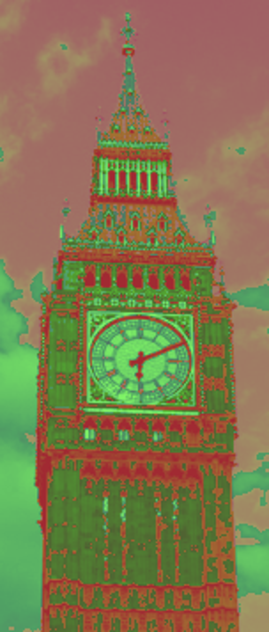
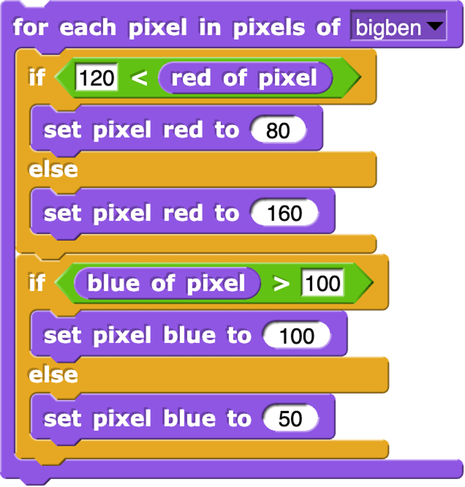
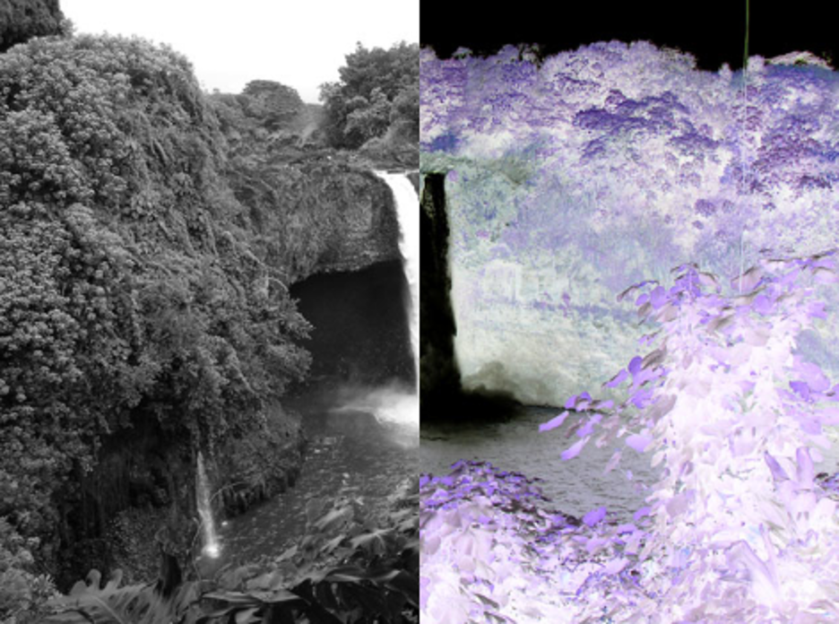
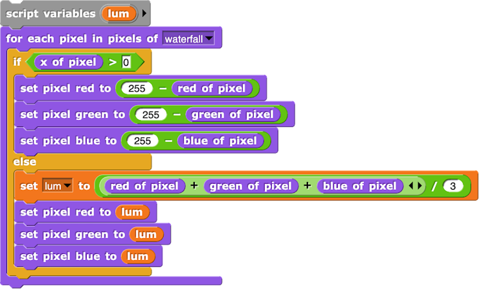

=======================================
Chapter 2: Pixels
=======================================

Section 1: Inverted Sheep
::::::::::::::::::::::::::

We saw the negation or color inverting program in class. It generates negated picture like this: 

.. image:: figures/sheepnegated.png

The program that generates this looks like this:

.. image:: figures/invertimage.png

Explaining the Snap program
---------------------------

As we talked in class, each component (or channel) color (red, green, and blue) is encoded as a single byte, and colors go from (0,0,0) to (255,255,255). 

In the main body of the code, it starts with a for loop that selects each pixel in the pixels of the “sheep”. Then we set pixel red, pixel green, and pixel blue to a certain number. To achieve negating (reversing or inverting the color), we take 255 minus that value – we use 255 to minus the red pixel value in the picture, then 255 minus the green pixel value in the picture, then 255 minus the blue pixel value in the picture. 

The Python Version
----------------------

Let's replicate this in Python. Here is the picture we will be manipulating.

.. datafile:: sheepjpg
   :image:
   :fromfile: sheep.jpg

Press **run** to see this image get inverted/negated.

.. activecode::  sheepnegate
    :nocodelens:
    :datafile: sheepjpg

    import image

    img = image.Image("sheepjpg")

    # LOOP THROUGH ALL THE PIXELS
    pixels = img.getPixels()
    for p in pixels:

        # INVERT EACH COLOR CHANNEL
        p.setRed (255-p.getRed())
        p.setGreen (255-p.getGreen())
        p.setBlue (255-p.getBlue())
        img.updatePixel(p)

    # SHOW THE CHANGED IMAGE
    win = image.ImageWin(img.getWidth(),img.getHeight())
    img.draw(win)

Let's talk about how this works.

- `img = image.Image("sheep.jpg")` creates a picture from the `sheep.jpg` file. This part is invisible in Snap -- it happens when you drag the picture into the *costumes* tab.
- `pixels = img.getPixels()` creates a list of all the pixels in the picture.
- `for p in pixels` does the exact same thing as the `for each pixel in pixels`.

  - Each of the `set` functions changes the channel or component of that pixel.
  - `255-p.getRed()` means to subtract from 255 the current red channel of the pixel `p`.
  - `img.updatePixel(p)` tells the image to change itself from the newly manipulated pixel `p`. That happens in Snap, but inside the blocks.

- The last two lines tell the browser to create an image window and to drag the sheep (in the variable `img`) in that window.

Try answering these questions about the code above.

.. mchoice:: Invert1
    :correct: a
    :answer_a: We want to change all pixels in the picture.
    :answer_b: That's a necessary part of all Python programs.
    :answer_c: It declares our intention to use the variable `p`
    :answer_d: It's unnecessary
    :feedback_a: Yes, JavaScript has `for` loops for repetition.
    :feedback_b: Nope, only if you want a loop.
    :feedback_c: No -- it does put values in `p` but that's not the only purpose.
    :feedback_d: No, it's critical to process the pixels.

    Why do we have the `for` loop above?

.. mchoice:: Invert2
    :correct: d
    :answer_a: No real difference
    :answer_b: Turns the picture black
    :answer_c: Turns the picture white
    :answer_d: Inverts, but much darker.
    :feedback_a: No -- try it.
    :feedback_b: It's dark, but the picture is still there.
    :feedback_c: No, try it.
    :feedback_d: Yes, because all values greater than 120 go to 0, which is very dark.

    What would happen if we changed all the 255 values to 120? (Yes, it's totally fair to actually try it.)

.. mchoice:: Invert3
    :correct: a
    :answer_a: No real difference
    :answer_b: Turns the picture black
    :answer_c: Turns the picture white
    :answer_d: Turns the picture red.
    :feedback_a: Yes, it's true.  For many pictures, red works as a luminance value
    :feedback_b: No, try it.
    :feedback_c: No, try it.
    :feedback_d: No, it's still grayscale because red=green=blue.

    What if we set all three of red, green and blue to `255-p.getRed()`? (Yes, it's totally fair to actually try it.)

Section 2: Posterize Big Ben
:::::::::::::::::::::::::::::

We saw a program that reduces the range of colors in two of the channels in class. It generates pictures like this: 

The program that generates this looks like this:

Explaining the Snap program
---------------------------

Most pictures have a range of values in red, green, and blue channels -- 0 to 255 in each, for 256 * 256 * 256 possible colors, well over 14 million. When we *posterize*, we reduce that possible range of colors.  In this example, we are making all red channels one of two values (80 or 160) and all blues to one of two values (100 or 50).  If we also limited to greens to two values, there would only be 8 possible colors in the whole picture.  When you make a picture with poster paint, you usually only have a handful of colors -- thus, *posterizing* is reducing the number of colors available.

The Python Version
----------------------

Let's replicate this in Python. Here is the picture we will be manipulating.

.. datafile:: bigbenjpg
   :image:
   :fromfile: bigben.jpg

Press **run** to see this image get inverted/negated.

.. activecode::  bigbenposterize
    :nocodelens:
    :datafile: bigbenjpg

    import image

    img = image.Image("bigbenjpg")

    # LOOP THROUGH ALL THE PIXELS
    pixels = img.getPixels()
    for p in pixels:

      # POSTERIZE EACH COLOR CHANNEL 
      if p.getRed() > 120:      
         p.setRed (80)
      else: 
         p.setRed (160)
      if p.getBlue() > 100: 
         p.setBlue (100)
      else: 
         p.setBlue (50)

      img.updatePixel(p)

    # SHOW THE CHANGED IMAGE
    win = image.ImageWin(img.getWidth(),img.getHeight())
    img.draw(win)

Let's talk about how this works.

If-else means that either one path is taken (if the red is greater than 120), or the other is taken (if the red is less than or equal to 120).  *Always* one of those two paths are taken.  Thus, at the end of the loop, red will be either 80 or 160 and blue will be either 100 or 50.

Notice the indentation.  That's critical in Python.  Python uses indentation to figure out which part happens if red is greater than 120 (`p.setRed(80)`), and then that the `else:` matches the `if` (because they're indented the same).  Notice the `img.updatePixel(p)` is indented the same as the `if` statements, but indented *more* than the `for` loop.  That means the `if` statements and the update of the pixel are all *inside* the `for` loop.  What's in the loop and what's outside the loop is easier to see with the shapes and colors of Snap.

Now, answer some questions about the code, please.

.. mchoice:: Poster1
    :correct: a
    :answer_a: We want to change all pixels in the picture.
    :answer_b: That's a necessary part of all Python programs.
    :answer_c: It declares our intention to use the variable `p`
    :answer_d: It's unnecessary
    :feedback_a: Yes, JavaScript has `for` loops for repetition.
    :feedback_b: Nope, only if you want a loop.
    :feedback_c: No -- it does put values in `p` but that's not the only purpose.
    :feedback_d: No, it's critical to process the pixels.

    Why do we have the `for` loop in *this* example above?

.. mchoice:: Poster2
    :correct: c
    :answer_a: We would add `p.setGreen()` to one of the existing `if` statements
    :answer_b: We would add `p.setGreen()` to each of the `if` and `else` clauses of one of the `if` statements.
    :answer_c: Need to add a statement like `if (p.getGreen()>100)`
    :feedback_a: No, just adding one setGreen wouldn't split all the green values.
    :feedback_b: Yes, that would reduce the green, but if you didn't choose the green values based on what was there before, it would probably look green.
    :feedback_c: Yes, we would want to choose where to split the green values.

    If we wanted to reduce the range of green, we'd add to this program:

.. mchoice:: Poster3
    :correct: c
    :answer_a: It doesn't really matter, as long as we have two values of red.
    :answer_b: It's probably a mistake.
    :answer_c: We're almost inverting red, since large values go lower and small values go higher.
    :answer_d: It wouldn't work any other way.
    :feedback_a: It's true that any values will result in posterizing, but if we want the picture to look like the original, the new values should be inside the split.
    :feedback_b: Nope, definitely picked those values on purpose.
    :feedback_c: Yes, exactly.  Try it the other way and see what you think.
    :feedback_d: Nope, any value between 0 and 255 would work.   

    Something weird about this posterize is that if red is larger than 120, we're setting it to a value less than 120 (80) and otherwise setting it to a value larger than 120 (160). The effect is:

Section 3: Grayscale and Invert
:::::::::::::::::::::::::::::::::

We saw a program in Snap in class that does two different effects to each side of the picture. It generates pictures like this: 

The program that generates this looks like this:

Explaining the Snap program
---------------------------

This program is making a choice based on the *x* value of the pixel. The left of center is negative *x*, and right of center is positive *x*.  This program inverts the right side (greater than 0), and computes grayscale for the leftside.  To compute the grayscale, we compute the average of the red, green, and blue components as a *luminance*.  We set all three of red, green, and blue to that luminance value.

The Python Version
----------------------

Let's replicate part of this in Python. Here is the picture we will be manipulating.

.. datafile:: waterfalljpg
   :image:
   :fromfile: waterfall.jpg

Press **run** to see this image get inverted/negated.

.. activecode::  waterfallsplit
    :nocodelens:
    :datafile: waterfalljpg

    import image
    img = image.Image("waterfalljpg")

    # LOOP THROUGH ALL THE PIXELS
    pixels = img.getPixels()
    for p in pixels:
       # CHANGE EACH COLOR CHANNEL TO LUM
       lum = (p.getRed()+p.getBlue()+p.getGreen())/3
       p.setRed (lum)
       p.setBlue (lum)
       p.setGreen (lum)
       img.updatePixel(p)

    # SHOW THE CHANGED IMAGE
    win = image.ImageWin(img.getWidth(),img.getHeight())
    img.draw(win)

This program is creating grayscale, but to the whole picture.  Like in the original Snap program, `lum` is a variable that will store the *luminance*.  We set it to the average of red, green, and blue.

Now, answer some questions about the code, please.

.. mchoice:: waterfall1
    :correct: a
    :answer_a: We see grayscale still.
    :answer_b: We will see all red.
    :answer_c: We will see no red.
    :answer_d: It will go black.
    :feedback_a: Turns out that it mostly works! Red is a good value for grayscale.
    :feedback_b: No, it will be gray if red = green = blue.
    :feedback_c: Sort of, but we won't see green or blue either.
    :feedback_d: No, that won't happen.  

    What happens if we set `lum = p.getRed()`?  (Feel free to try it!)

.. mchoice:: waterfall2
    :correct: c
    :answer_a: `lum` is a predefined value for luminance.
    :answer_b: `lum` is the same value for all pictures.
    :answer_c: `lum` is a temporary, local value for storing the luminance.
    :feedback_a: No, we could have named that variable anything.
    :feedback_b: No, it will be different for *ever* pixel.
    :feedback_c: Yes, exactly. 

    Which of the following about `lum` in both programs is true?

.. mchoice:: waterfall3
    :correct: b
    :answer_a: It will be the same grayscale.
    :answer_b: It will be mostly grayscale, with a slight green colored tinge.
    :answer_c: It will go black entirely.
    :feedback_a: No, blue contains important information.
    :feedback_b: Exactly -- try it!
    :feedback_c: Nope, pixels will still be different values and still distinct.

    What would happen if you deleted the line `p.setBlue(lum)`? (Feel free to try it!)
