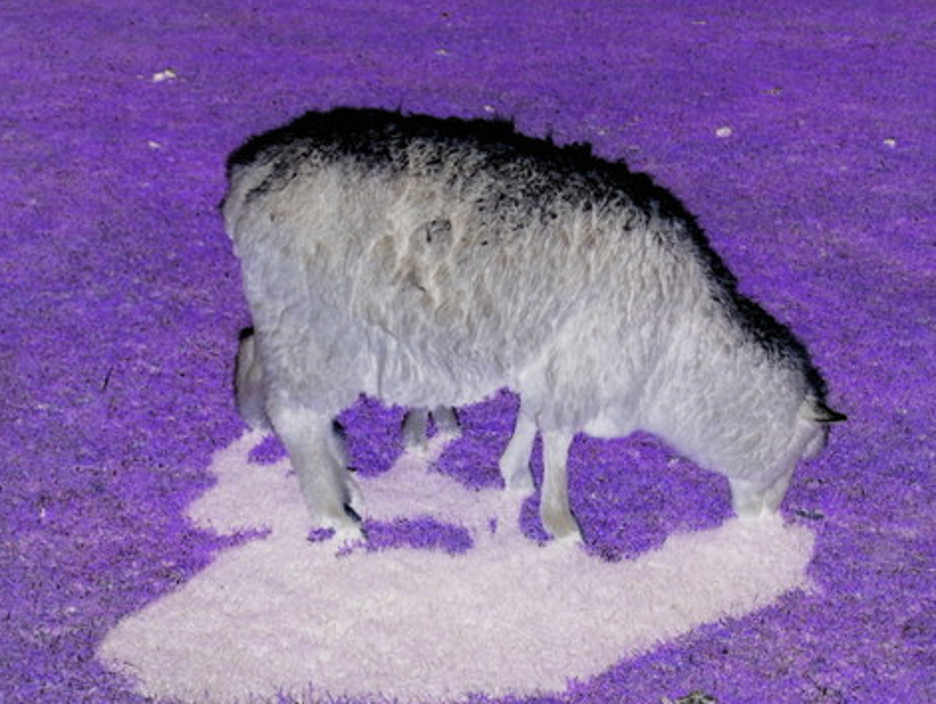
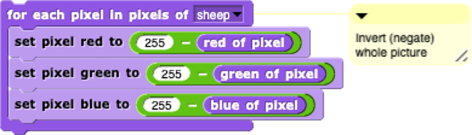

=======================================
Chapter 1: Pixels
=======================================

Section 1: Inverted Sheep
::::::::::::::::::::::::::

We saw the inversion program in class. It generates negated picture like this: 

The program that generates this looks like this:

Explaining the Snap program
---------------------------

As we talked in class, each component color (red, green, and blue) is encoded as a single byte, and colors go from (0,0,0) to (255,255,255). 

In the main body of the code, it starts with a for loop that selects each pixel in the pixels of the “sheep”. Then we set pixel red, pixel green, and pixel blue to a certain number. To achieve negating – which is defined as 255 minus that value – we use 255 to minus the red pixel value in the picture, then 255 minus the green pixel value in the picture, then 255 minus the blue pixel value in the picture. 

The Python Version
----------------------

Let's replicate this in Python.

.. datafile:: sheepjpg
   :image:
   :fromfile: sheep.jpg

.. activecode::  sheepnegate
    :nocodelens:
    :datafile: sheepjpg

    import image

    img = image.Image("sheep.jpg")
    win = image.ImageWin(img.getWidth(), img.getHeight())
    img.draw(win)

    # LOOP THROUGH ALL THE PIXELS
    pixels = img.getPixels()
    for p in pixels:

        # INVERT EACH COLOR CHANNEL
        setRed (p, 255-getRed(p))
        setGreen (p, 255-getGreen(p))
        setBlue (p, 255-getBlue(p))
        img.updatePixel(p)

    # SHOW THE CHANGED IMAGE
    win = ImageWin(img.getWidth(),img.getHeight())
    img.draw(win)

Let's talk about how this works...
