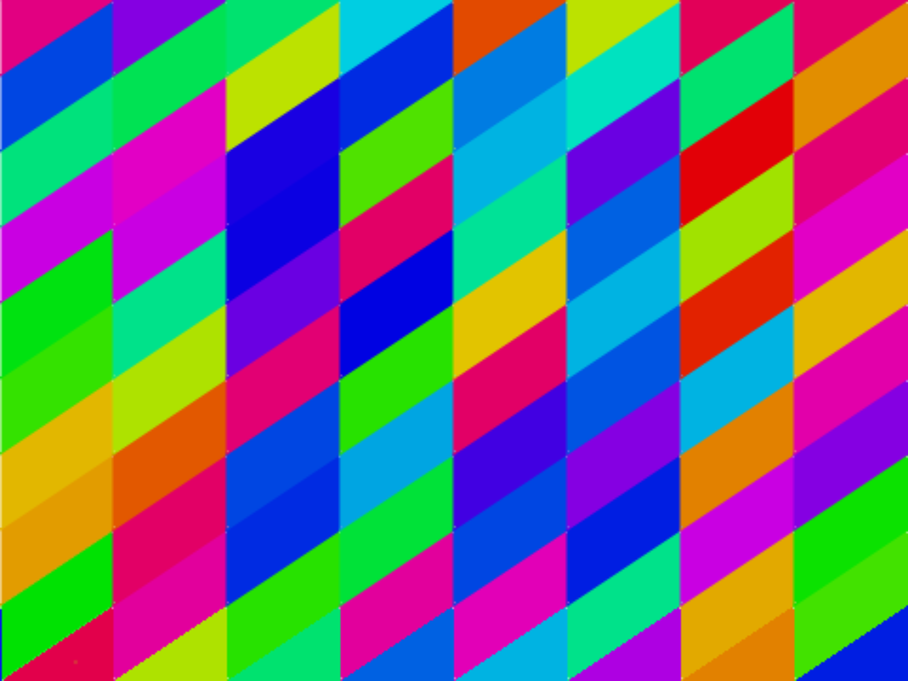
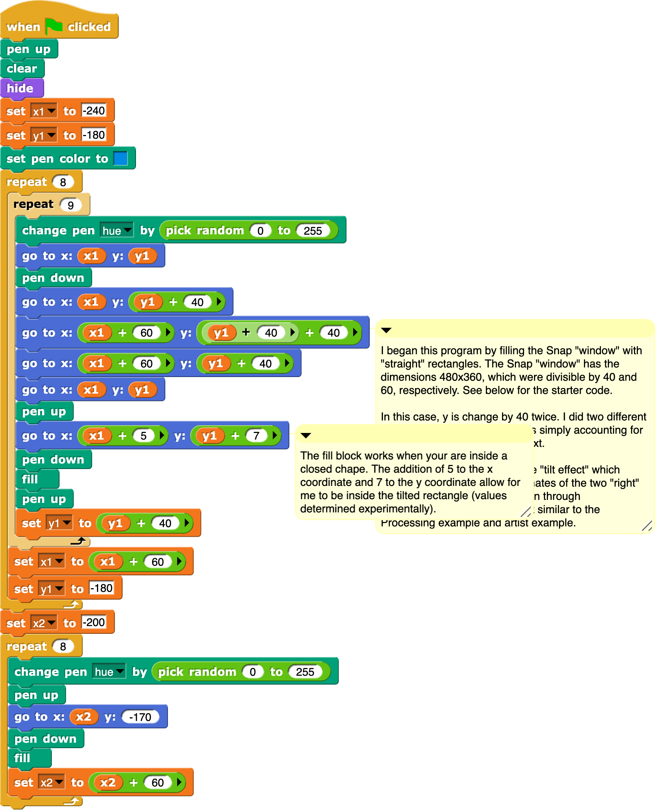
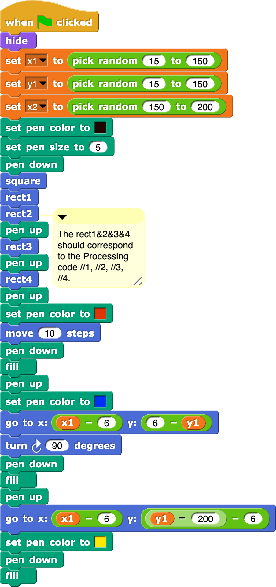
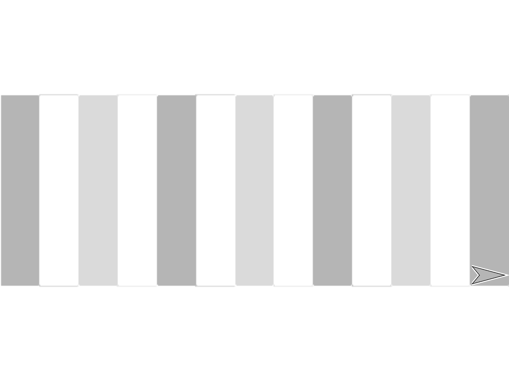

=======================================
Chapter 1: Shapes
=======================================

Section 1: Riley Quilt
::::::::::::::::::::::::::

We saw the Riley Quilt program in class. You can `run it here <https://snap.berkeley.edu/snap/snap.html#present:Username=guzdial&ProjectName=Riley&editMode&noRun>`_ It generates random slanted tiles, like this:

The program that generates this looks like this:

Explaining the Snap program
---------------------------

The Snap program uses two variables `x1` and `y1` that will represent the position on the screen of each tile, at the lower left hand position.  

The main body of the program is the `repeat 8` loop (which generates the 8 rows of tiles) and the `repeat 9` loop (which generates the 9 tiles within each row).  You may wonder why this is using variables for positions and `go to x: y:` blocks.  We know that we can move the sprite easily with `turn` and `move` blocks.  Chloe did it this way to make it look a lot like the Processing version.

Within the two loops are the blocks which draw the tiles.  First, a random pen `hue` is selected. The pen goes to the `x1` and `y1` position. The pen is moved to draw the four sides of the tile with `go to x: y:` blocks.  The little bit at the bottom fills the tile with color.  The bottom of the first loop is where we add 40 to `y1` to go to the next tile in the row. The set `x1` at the bottom of the second loop starts the next row.

The very bottom `repeat 8` loop draws the little triangles at the bottom of each row.  You can pull it off and re-run the program to see what happens when that extra bit is gone.  It still works, but not all the tiles are there.

The Processing Version
----------------------

The Processing version uses `P5.js <https://p5js.org/>`_ which is a JavaScript library for running Processing code.  Click the **Render** button below to see the code run.  Each time you click **Render**, you'll get a different drawing.

.. activecode:: htmlriley
   :language: html
   :nocodelens:

   <html>
       
   <body>
   
   </body>

   </html>

Try answering these questions about the code above.

.. mchoice:: PSRiley1
    :correct: a
    :answer_a: for
    :answer_b: let
    :answer_c: fill
    :answer_d: quad
    :feedback_a: Yes, JavaScript has `for` loops for repetition.
    :feedback_b: No, that creates a variable.
    :feedback_c: No, that picks the color.
    :feedback_d: No, that draws the tile.

    In the Snap program, there were two `repeat` loops that drew the rows and columns of the tiles. What statement above is like the `repeat` loop in Snap?

.. mchoice:: PSRiley2
    :correct: d
    :answer_a: a,b
    :answer_b: b,c
    :answer_c: x1,y1
    :answer_d: i,j
    :feedback_a: No, those are being used to pick random colors
    :feedback_b: No, those are being used to pick random colors.
    :feedback_c: No, those variables aren't here.
    :feedback_d: Yes, but i,j here just keep track of the count of the tiles. The positioning is done elsewhere.

    In the Snap program, the variables `x1` and `y1` are used to position each tile.  What are the variables used to keep track of each tile in this Processing program?

.. mchoice:: PSRiley3
    :correct: a
    :answer_a: It's drawing the shape, using the i,j variables for positioning, then computing the four corners of the tile.
    :answer_b: It's computing a random color using i,j to make sure that each tile is uniquely colored
    :answer_c: It's launching a quad copter to look in on the classroom.
    :answer_d: It's looping through all possible values of i and j.
    :feedback_a: That's right. Given a height of 50 and width of 60, each position can be calculated.
    :feedback_b: No, a, b, and c are being used to figure out a random value of red, green, and blue.
    :feedback_c: No, there is no quad copter here.
    :feedback_d: No, that's what the `for` statements are doing.

    There is a lot of math going on in the statement that starts with `quad`. What do you think is going on there?

Section 2: Piet Mondrian
::::::::::::::::::::::::::
`Piet Mondrian <https://en.wikipedia.org/wiki/Piet_Mondrian>`_ was a Dutch artist known for his abstract art with simple geometric shapes in primary colors.

Here is a Snap program that generates random art like that of Piet Mondrian. You can find the `project here <https://snap.berkeley.edu/project?username=guzdial&projectname=Piet_Mondrian>`_ so you can play with it yourself, or download the picture of the code and drag that into your Snap project.

This program generates images like this:

.. image:: figures/Piet-Mondrian-stage.png

Explaining the Snap program
---------------------------

This Snap program uses three variables: `x1`, `y1`, and `x2`. These are used to position the rectangles in the random Piet Mondrian (like) drawing.  The first parts of the script set the pen to black and a fairly thick (5 pixels) width.

The block `square` is a custom block that draws a square.

.. image:: figures/Piet_Mondrian-square.png

The four rectangle methods draw four different shapes at different positions within the drawing.

.. image:: figures/Piet_Mondrian-rect1.png

.. image:: figures/Piet_Mondrian-rect2.png

.. image:: figures/Piet_Mondrian-rect3.png

.. image:: figures/Piet_Mondrian-rect4.png

The very bottom of the Snap program adds blocks of yellow, blue, or red with the `fill` method.

Try the project to get a feel for how it works.

The Processing Version
----------------------

The Processing version uses `P5.js <https://p5js.org/>`_ which is a JavaScript library for running Processing code.  Click the **Render** button below to see the code run.  Each time you click **Render**, you'll get a different drawing.

The below is an HTML file. P5.js runs inside of an HTML file. The beginning of it sets up an HTML page and references the P5.js script. What's inside of `
   <body>
   
   </body>

   </html>

Try answering these questions about the code above.

.. mchoice:: PM1
    :correct: b
    :answer_a: red
    :answer_b: myColors
    :answer_c: r
    :answer_d: randomcolorindex2
    :feedback_a: Red is not a variable in this program.
    :feedback_b: Yes, it's an `array` with four colors in it.
    :feedback_c: No, r is a position inside the drawing.
    :feedback_d: No, randomcolorindex2 is used for randomly choosing a color.

    Which variable is storing the four primary colors used in a Piet Mondrian piece?

.. mchoice:: PM2
    :correct: a
    :answer_a: 500 pixels by 500 pixels
    :answer_b: 25 pixels by 475 pixels
    :answer_c: #0000fa
    :answer_d: 0 by 3
    :feedback_a: Yes, and `createCanvas` makes the space that will be drawn in
    :feedback_b: No, those are the dimensions for points (rectangles) within the drawing
    :feedback_c: No, that's a specification for a color.
    :feedback_d: No, random(0,3) returns a random number 0, 1, 2, or 3.

    The size of the drawing is?

.. mchoice:: PM3
    :correct: c
    :answer_a: set pen color to
    :answer_b: pen down
    :answer_c: set pen size to
    :answer_d: fill
    :feedback_a: No, that's the input to fill()
    :feedback_b: No, there is not a pen in Processing
    :feedback_c: Yes, exactly.
    :feedback_d: No, fill in Snap is pretty close to fill in Processing.

    The function strokeWeight is closest to which Snap block?

Section 3: Corse Gray Lines
:::::::::::::::::::::::::::::

This is the simplest of the three examples.  It simply draws lines of gray. You can `see the Snap project here <https://snap.berkeley.edu/project?username=guzdial&projectname=Corse>`_.  The output looks like this.

This program looks like this:

.. image:: figures/Corse-script-pic.png

Explaining the Snap program
---------------------------

This program is creating 13 *tracks*.  The bit of code that says `i mod 2 = 1` is basically testing if it's an even or odd track.  Each line is drawn using `go to x: y:` blocks, and filled. 

You might wonder what that "36.9230792" magic number is about. Chloe, who wrote this program, explains it like this: The Snap stage has the dimensions 480x360 -- 480 pixels across and 360 pixels up and down. In order to fit 13 rectangles into this space, I determined 480/13 = 36.92307692 for the width dimension of each rectangle.

The Processing Version
----------------------

The Processing version uses `P5.js <https://p5js.org/>`_ which is a JavaScript library for running Processing code.  Click the **Render** button below to see the code run.  Each time you click **Render**, you'll get a different drawing.

The below is an HTML file. P5.js runs inside of an HTML file. The beginning of it sets up an HTML page and references the P5.js script. What's inside of `
   <body>
   
   </body>

   </html>

Try answering these questions about the code above.

.. mchoice:: Corse1
    :correct: b
    :answer_a: 0+100*i
    :answer_b: if(i%2!=0)
    :answer_c: let i = 0; i < 13; i++
    :answer_d: if(track == 0)
    :feedback_a: No, that's being used to figure out a position for a rectangle.
    :feedback_b: Yes, % is the mod operator.
    :feedback_c: No, that's defining the loop for 13 rectangles.
    :feedback_d: No, that's dealing with coloring the rectangles differently.

    One of the weird bits in the Snap code was testing for whether i was odd or even with `i mod 2 = 1`. Which part of the above is doing that?

.. mchoice:: Corse2
    :correct: c
    :answer_a: The same thing as parentheses
    :answer_b: They are just for making the code more complicated
    :answer_c: They define what parts of code are inside of loops or if statements.
    :feedback_a: No, parentheses don't group lines of code.
    :feedback_b: Might seem that way sometimes, but they have a purpose.
    :feedback_c: Yes. Without them, it's hard to tell what is part of the loop and what isn't.

    You have now seen three Processing programs, so you're probably getting a sense for how they work. What do you think the curly braces (`{}`) are doing?

.. mchoice:: Corse3
    :correct: a
    :answer_a: Defining the dimensions of the rectangle
    :answer_b: Defining the color.
    :answer_c: Defining the x, y, z, and time spacetime coordinates.
    :feedback_a: Exactly.
    :feedback_b: No, that's what fill and stroke are doing.
    :feedback_c: No, computers aren't that powerful.

    In the statement `rect(0+100*i,0,100,500);` there are basically four parts inside the parentheses, separated by commas. What do you think that they're for?