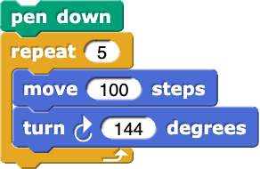
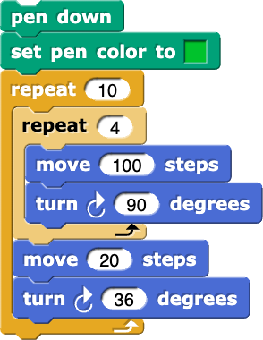
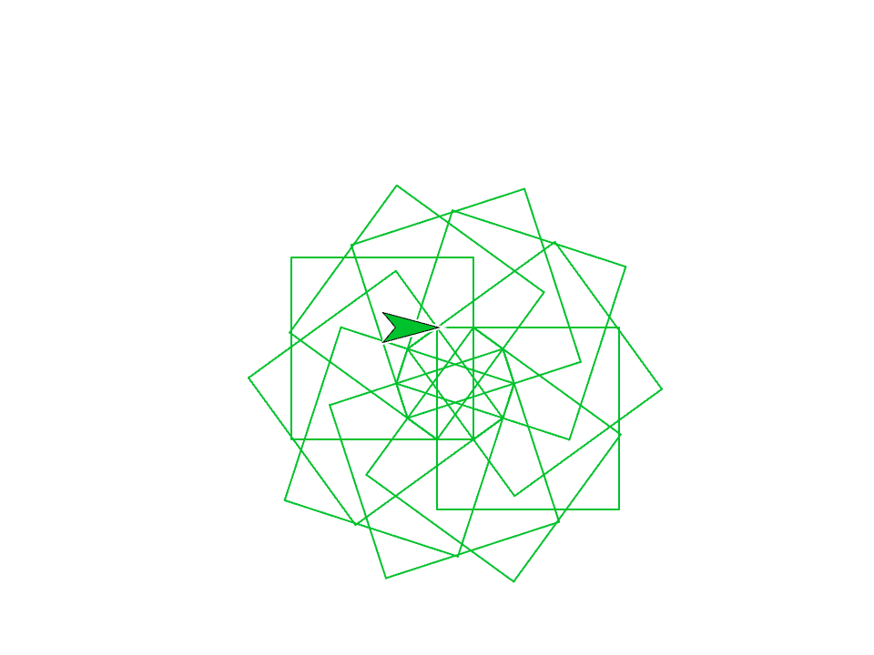
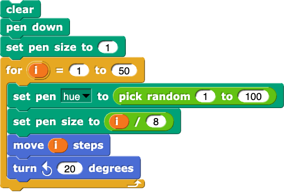
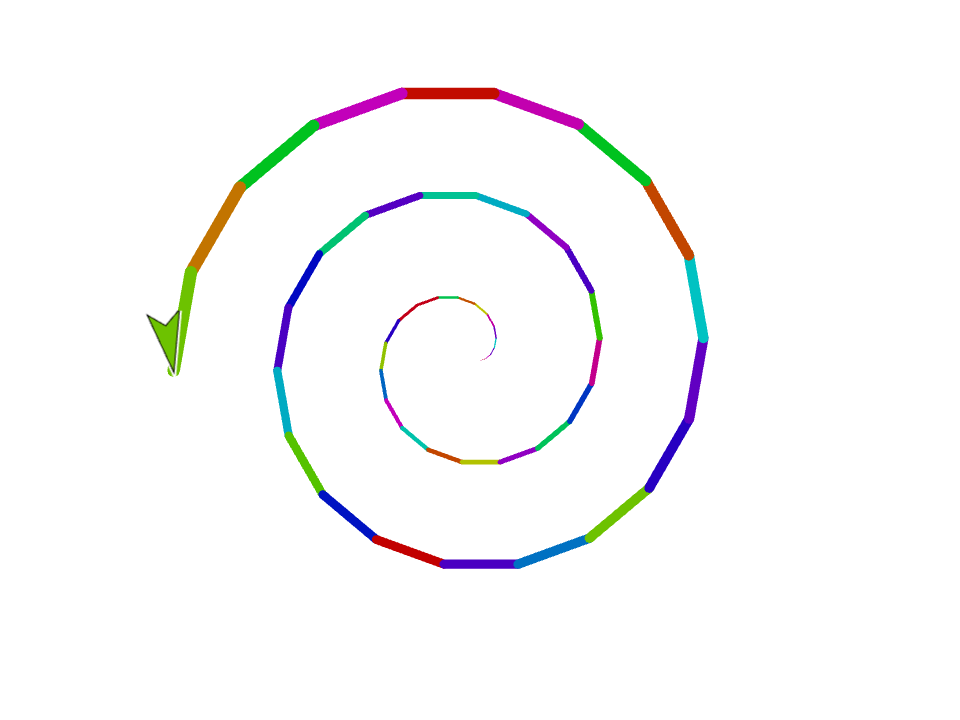
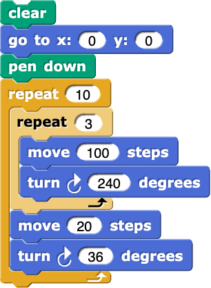

=======================================
Chapter 3: Turtles
=======================================

The sprite in Snap is based on a much older computational tool from the 1960's called a Turtle.  It first appeared in the `Logo programming <https://el.media.mit.edu/logo-foundation/what_is_logo/index.html>`_ language.  The original Turtle was a robot, and then was turned into an on-screen grahical turtle. Here is Seymour Papert, the inventor of the Turtle, with one of the early robot turtles.

.. image:: https://el.media.mit.edu/logo-foundation/what_is_logo/graphics/seymour.jpg

The turtle has been ported to many other programming languages today, which makes it an excellent place to explore how Snap programs appear in other programming languages. (Thanks to Chloe Nguyen for these examples.)

Section 1: Draw a Star
::::::::::::::::::::::::::

Here is a simple Snap program for drawing a star.

We can make this same program in both Python and in Processing. Click Run to try each of them out.

.. activecode::  starPython
    :nocodelens:

    import turtle
    star = turtle.Turtle()
 
    star.right(75)
    star.forward(100)
 
    for i in range(4):
      star.right(144)
      star.forward(100)
     
The Python version is pretty close to the Snap version.  We have to first `import` the library `turtle` in order to make turtles.  We create a turtle name it `star`.  Telling the turtle to turn right and move forward is much like it is in Snap.

.. activecode:: starProcessing
   :language: html
   :nocodelens:

   <html>
       
   <body>
   
   </body>

   </html>

P5.js can work with turtles, but it takes a bit of extra code. Ignore that stuff at the bottom, and just focus on what's in the `setUp()` function.  P5.js requires us to create a canvas where the turtle will draw. We set a background color of 0 (black). Then we make a turtle, put the pen down, then create the five lines of the star.  The rest of turning and moving forward is pretty much like what you might expect.

Let's think about this code a little bit.

.. mchoice:: star1
    :correct: a
    :answer_a: Indentation.
    :answer_b: Curly braces {}.
    :answer_c: Semi-colons
    :answer_d: Machine learning
    :feedback_a: Yes, Python uses indentation to decide which statements are "inside" the loop or a function definition.
    :feedback_b: No, there are no curly braces in this example.
    :feedback_c: No, semi-colons end the line in JavaScript, but not in Python.
    :feedback_d: No, there is actual syntax to figuring out what is inside the loop.

    How does Python know what statements are looped in the `for` loop?

.. mchoice:: star2
    :correct: b
    :answer_a: Indentation.
    :answer_b: Curly braces {}.
    :answer_c: Semi-colons
    :answer_d: Machine learning
    :feedback_a: No, Python uses indentation to decide which statements are "inside" the loop or a function definition.
    :feedback_b: Yes, like C and Java, JavaScript uses curly braces to decide what is "inside" a loop or function definition.
    :feedback_c: No, semi-colons separate lines in JavaScript.
    :feedback_d: No, there is actual syntax to figuring out what is inside the loop.

    How does JavaScript (p5.js) know what statements are looped in the `for` loop?

.. mchoice:: starsetup
    :correct: d
    :answer_a: Sets up the turtle to be later drawn.
    :answer_b: It's an arbitrary word and could be anything
    :answer_c: Same as in Snap or Python
    :answer_d: It's the first function called, and here, it does all turtle drawing.
    :feedback_a: No, the turtle drawing occurs inside of setUp().
    :feedback_b: No, the name has to be exactly setUp().
    :feedback_c: No, there is not a similar function in Snap or Python.
    :feedback_d: Yes, the setUp function creates a canvas, the turtle, and does the drawing.

    What do you think the setUp() function does in P5.js?

.. mchoice:: star5
    :correct: a
    :answer_a: The first line appears before the block.
    :answer_b: It only looks like the for loop goes four times -- it's actually going five.
    :answer_c: It's an optical illusion that the star has five lines.
    :answer_d: It would actually work if you change the 4's to 5's in both of the examples above. (Try it!)
    :feedback_a: Yes, the turtle goes forward into position before the other four lines are drawn.
    :feedback_b: No, it's really going 4 times.  Change the 4 to 3 to convince yourself.
    :feedback_c: No, the star has five lines.
    :feedback_d: This is actually true (try it!), but doesn't explain where the fifth line is.

    A star has five sides. The for loops in Python and p5.js only go four times. How do we still get a star?

Section 2: Draw Squares
::::::::::::::::::::::::::

Here is a Snap program for drawing a pattern with squares.

It creates a stage that looks like this:

We can make this same program in both Python and in Processing. Click Run to try each of them out.

.. activecode::  squaresPython
    :nocodelens:

    import turtle
    myShape = turtle.Turtle()
    myShape.pencolor("green") 
    myShape.speed(50)
    myShape.right(75)
    myShape.forward(100)
     
    for i in range(10):
        for i in range (4):
            myShape.forward(100)
            myShape.right(90)
        myShape.forward(20)
        myShape.right(36) 

     
The Python version is again close to the Snap version.  One interesting difference is the `speed` function.  Try changing it to see what it does.

.. activecode:: squaresProcessing
   :language: html
   :nocodelens:

   <html>
       
   <body>
   
   </body>

   </html>

.. mchoice:: squares1
    :correct: a
    :answer_a: It still works, but it's a slightly different figure.
    :answer_b: You don't get complete squares.
    :answer_c: It changes to pentagons.
    :answer_d: It changes to rectangles.
    :feedback_a: Yes, because the turtle then makes the next square from a different position.
    :feedback_b: No, it still works fine.
    :feedback_c: No, we can't get pentagons if we're turning 90.
    :feedback_d: No, that can't work if we're always going forward 100.

    Okay, there might be a bug in the Processing example. The interior loop says "5". Squares have only 4 sizes. What happens if you change it to 4? (Go ahead and try it.)

.. mchoice:: squares2
    :correct: c
    :answer_a: Absolutely nothing -- you could leave it out.
    :answer_b: It's a reserved name in both languages. It must be called i.
    :answer_c: It's a necessary index variable for a FOR loop, but it could be called anything. 
    :answer_d: It's a necessary index variable for a FOR loop, but it must be i, j, k, or l.
    :feedback_a: No, it's necessary.
    :feedback_b: No, it could be anything. Try changing them to "j".
    :feedback_c: Absolutely true. Change them all the "i" to "fred" and see what happens.
    :feedback_d: It's necessary, but could be anything.  Mathematicians tend to like i, j, k, and l for index variables, so that's why it's often those.

    What is the role of the variable i in both the Python and Processing examples?

.. mchoice:: squares3
    :correct: b
    :answer_a: Exact same figure.
    :answer_b: It's a different figure, but it is still a closed shape.
    :answer_c: It's a different figure, but now it's an open shape. It's left dangling. 
    :feedback_a: No, it changes. (Did you try it?)
    :feedback_b: Yup. Actually, most values for turning in the outer loop will work.
    :feedback_c: No, it still closes. Try it!

    What happens if you change the "36" in the outer loop to "72"? (Yes, you can go try it.)

Section 3: Draw A Spiral
::::::::::::::::::::::::::

Here is a Snap program for drawing a spiral pattern.

It creates a stage that looks like this:

We can make this same program in both Python and in Processing. Click Run to try each of them out.

.. activecode::  spiralPython
    :nocodelens:

    import turtle
    import random 
    myShape = turtle.Turtle()
    for i in range(50):
        myShape.color(random.random(), random.random(), random.random()) 
        myShape.pensize(i/8)
        myShape.forward(i)
        myShape.left(20)

     
The difference between the Python and Snap version is that random colors are selected in Python with a random number for each of red, green, and blue.  In Snap, we select a random hue between 0 and 100.

.. activecode:: spiralProcessing
   :language: html
   :nocodelens:

   <html>
       
   <body>
   
   </body>

   </html>

.. mchoice:: spiral1
    :correct: a
    :answer_a: A real number between 0 and 1.0
    :answer_b: An integer between 0 and 255.
    :answer_c: A real number between -1.0 and 1.0
    :answer_d: Something random.
    :feedback_a: Yes. It's like our sound samples in Snap.
    :feedback_b: No -- maybe if we told it to 255 somewhere.
    :feedback_c: A good guess, but it's not how it works.
    :feedback_d: Yes, random, but not completely random.

    We know that each of red, green, and blue is a value between 0 and 255 in Snap.  In Python, it's three values of random.random().  What do you think random.random() returns?

.. mchoice:: spiral2
    :correct: c
    :answer_a: Because i/10 would break the program.
    :answer_b: Because i/50 would break the program
    :answer_c: Because just i would get too big. We want to be able to see all the lines. 
    :answer_d: It's totally not necessary.
    :feedback_a: No, it would work. Try it.
    :feedback_b: No, it could work. Try it.
    :feedback_c: It's true. Try it.
    :feedback_d: That's true, but the lines get hard to see without it. Try it.

    Why do you think we set the pen size to i/8?

.. mchoice:: spiral3
    :correct: b
    :answer_a: The shape is in 3-D
    :answer_b: It's in grayscale, not color.
    :answer_c: The spiral goes in the opposite direction. 
    :feedback_a: No, it's all 3-D
    :feedback_b: Yup, that's how setColor with one input works.
    :feedback_c: No, but if you change 'left' to 'right', it'll work in the other direction, for both Python and Processing.

    The Processing version is different in this respect? (Guess you'll have to try it to know!)

Section 4: Draw Triangles
::::::::::::::::::::::::::

Here is a Snap program for drawing a triangle pattern.

It creates a stage that looks like this:

.. image:: figures/triangle-stage.png

Below is a Python program that generates the same output, but the lines are scrambled.  Put them in the right order.  Drag the needed blocks of statements from the left column to the right column and put them in the right order.  Click on *Check* to see if you are right. You will be told if any of the lines are in the wrong order or are the wrong blocks.

.. parsonsprob:: triangle
    :numbered: left
    :noindent:
    :adaptive:

    -----
    import turtle
    myShape = turtle.Turtle()
    myShape.speed(100)
    =====
    for i in range(10):
    =====
        for j in range (3):
    =====
        for j in range (3) #paired
    =====
           myShape.forward(100)
    =====
           myShape.right(240)
    =====
        myShape.forward(20)
    =====
        myShape.right(36)

